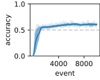

# SeL-NAL

This repo contains the source code of the paper *A Brain-inspired Sequence Learning Model based on Non-Axiomatic Logic*.

## Compilation

This project is python-C++ mixed.
The C++ code is compiled by `g++`, with the standerd `C++20`; older C++ standards (*e.g.*, `c++11`) and other compilers (*e.g.*, `clang`) are not ensured to work.

To compile the C++ code, run the commands as the following
```
git submodule update --init --recursive
mkdir build
cd build
cmake ..
make
```
There would be two target folders, `./narsese` and `./SequentialGroup`, which are also two python modules.

## Run

To test the capacity of the model, run the command
```
python -m test_capacity
```

To test the catastrophic forgetting phenomenon of the model, run the command
```
python -m test_catastrophic_forgetting
```

Run the jupyter-notebook `tests.ipynb` to get all related figures from tests.

## Debug

Python-C++ mixed debugging is avaiable in VS-Code. To do so, the extension `Python C++ Debugger` is needed. Select the task "Python C++ Mixed" in `.vscode/launch.json`, and run and debug.

To enter a C++ file, a break point should be set up before debugging.

## Performance

### Capacity


length=5, n_patterns=5, n_types=26


length=14, n_patterns=20, n_types=26


length=14, n_patterns=20, n_types=1000

### Continual Learning (without Catastrophic Forgetting)


length=10, n_patterns=10, n_types=26, n_repeats=3, n_episods=3

## Citation

This work is still under peer review. 

Cite as

```bibtex
@article{xu2023selnal,
  title={A Brain-Inspired Sequence Learning Model based on a Logic},
  author={Xu, Bowen},
  journal={arXiv preprint arXiv:2308.12486},
  year={2023}
}
```
(bibtex)
